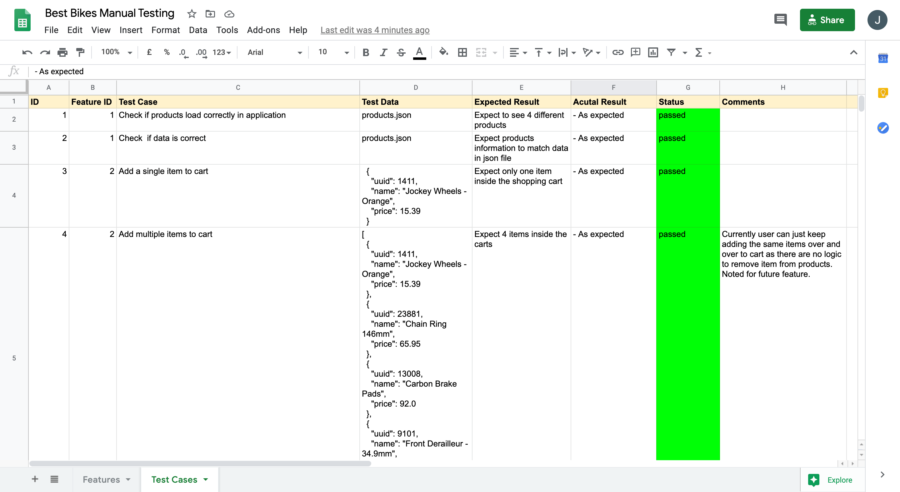

# Best Bikes
--- 

## Installation Guide
---
This project require ruby to run, it was created on Ruby version 2.7.1

[Click here to learn about how to install ruby.](https://www.ruby-lang.org/en/documentation/installation/)

1: clone this Repo
```
git clone https://github.com/ping-n/best_bike_cli.git
```

2: cd into the root directory

3: install Bundler
```
gem install bundler
```

4: run bundle install to install the dependencies
```
bundle install
```

5: run the following command in the root directory of the application
```
ruby lib/app.rb
```

#### Notes
---

Products are loaded from products.json in the data directory.

New products can be added to the terminal application but stick to the json format below to ensure the application works.

```json
// products.json file
  [
    {
      "uuid": <product uuid>,
      "name": <product name>,
      "price": <product price>
    },
    {
      "uuid": <product uuid>,
      "name": <product name>,
      "price": <product price>
    }
  ]
```

### Testing
---

To run rspec tests
```
bin/rspec
```

### Manual Testing

Manual testing spreadsheet can be found inside the test directory.



## Features
---

Feature:

- Load products from a JSON file
- Display products in terminal
- Add multiple products to the shopping cart
- View Shopping Cart
- Purchase the products
- Apply discounts
  - 10% off for total over $20
  - 15% off for total over $50
  - 20% off for total over $100

## Design
---
- DRY principal - keeping code dry and easy to read
- OOP - Class base programming for maintainability and readability (Product class, Cart class)
- MVC framework-  splitting application into Model, View and Controller
- User friendly - fun and easy to navigate menu
- Error handling - extensive manual testing and handle exception when cart is empty
- Testing - unit testing and integration tests through rspec and extensive manual testing.
- Code standard - sticking to ruby convention with naming of variable and classes. Made use of rubocop to ensure high code standard.